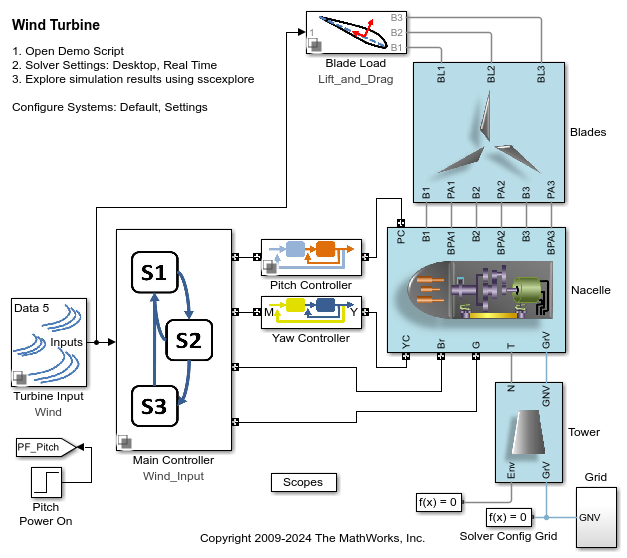
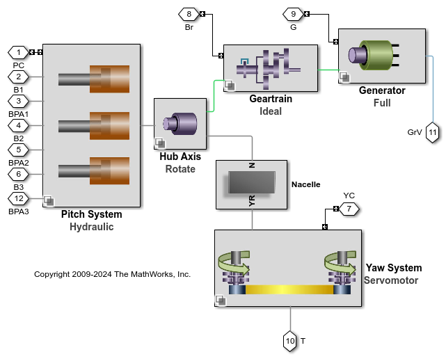
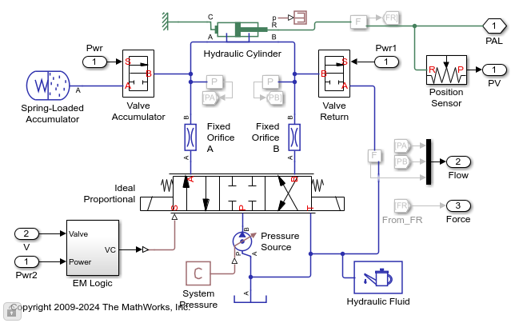

# **Wind Turbine Design with Simscape**
This example models a wind turbine with pitch actuators, yaw actuators, geartrain, 
and generator. The fidelity level of each system can be adjusted so that it is 
suitable for the test being performed.

* **Size actuators** using ideal actuator models to determine required forces.
* **Perform virtual tests of physical system and controller** with hydraulic pitch and electrical yaw actuators.
* **Optimize controller performance** with hydraulic pitch and electrical yaw actuators.
* **Assess grid integration** with model of generator and electric grid.
* **Run HIL tests** with real-time capable model of wind turbine.

Open project "Wind_Turbine.prj" to get started.

View on File Exchange:   
You can also open in MATLAB Online: 

## **Wind Turbine Animation Clip**

## **Model of Wind Turbine**

## **Wind Turbine Systems**

## **Pitch Actuation System**

To learn more about modeling and simulation with Simscape, please visit:
* [Simscape Getting Started Resources](https://www.mathworks.com/solutions/physical-modeling/resources.html)
* Product Capabilities:
   * [Simscape&trade;](https://www.mathworks.com/products/simscape.html)
   * [Simscape Battery&trade;](https://www.mathworks.com/products/simscape-battery.html)
   * [Simscape Driveline&trade;](https://www.mathworks.com/products/simscape-driveline.html)
   * [Simscape Electrical&trade;](https://www.mathworks.com/products/simscape-electrical.html)
   * [Simscape Fluids&trade;](https://www.mathworks.com/products/simscape-fluids.html)
   * [Simscape Multibody&trade;](https://www.mathworks.com/products/simscape-multibody.html)

Copyright &copy; 2025 The MathWorks, Inc.